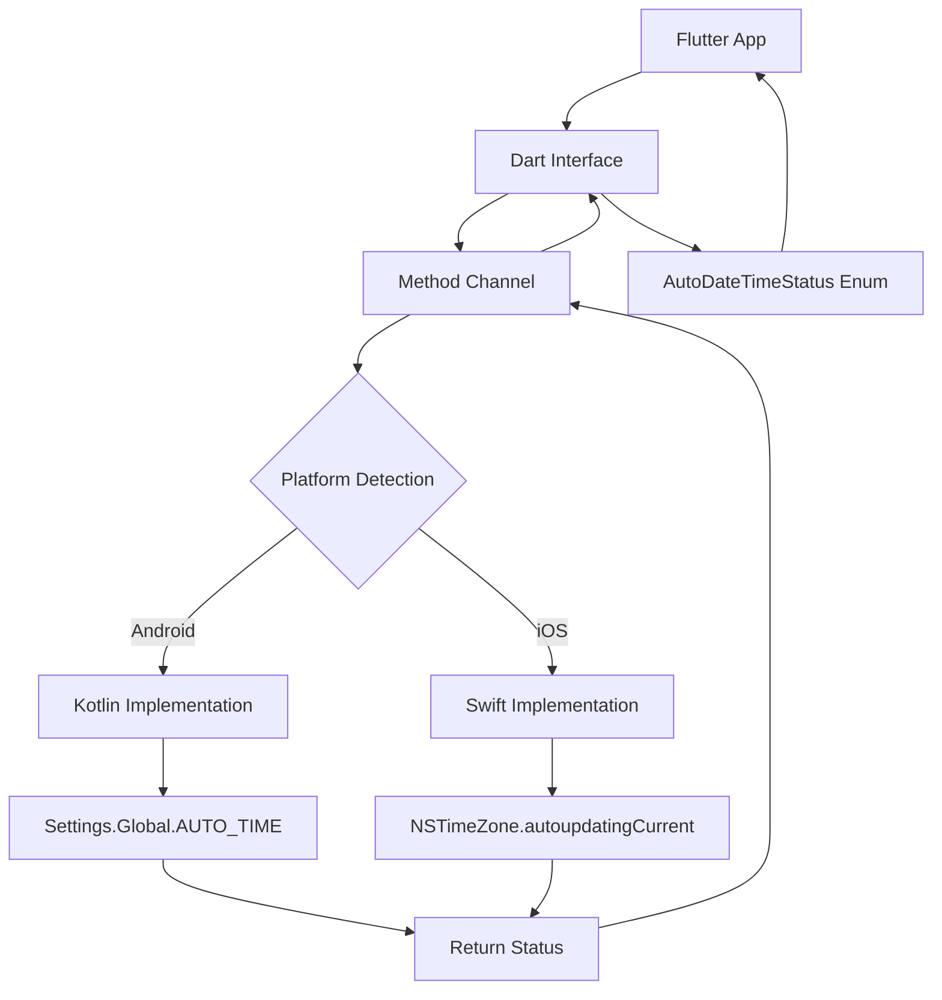

# Date Change Checker Flutter Package - Product Requirements Document

## 1. Product Overview

A cross-platform Flutter package that detects whether the device's automatic date/time setting is disabled, providing unified functionality for both Android and iOS platforms.

The package solves the critical need for applications to verify if users have automatic date/time synchronization enabled, ensuring data integrity and preventing time-based security vulnerabilities. Target developers building apps requiring accurate timestamp validation and time-sensitive operations.

## 2. Core Features

### 2.1 User Roles

No user role distinction required - this is a developer-focused package for integration into Flutter applications.

### 2.2 Feature Module

Our date\_change\_checker package consists of the following main components:

1. **Dart Interface**: Primary API with checkAutoDateTimeStatus() method and AutoDateTimeStatus enum
2. **Android Implementation**: Kotlin-based detection using Settings.Global.AUTO\_TIME
3. **iOS Implementation**: Swift-based detection using NSTimeZone.autoupdatingCurrent
4. **Method Channel Bridge**: Communication layer between Dart and native platforms
5. **Example Application**: Complete demo showcasing package functionality
6. **Documentation**: Comprehensive API documentation and usage guides

### 2.3 Page Details

| Component              | Module Name            | Feature Description                                                                                            |
| ---------------------- | ---------------------- | -------------------------------------------------------------------------------------------------------------- |
| Dart Interface         | Core API               | Expose checkAutoDateTimeStatus() method returning AutoDateTimeStatus enum with AUTO\_DATE\_TIME\_ON/OFF values |
| Dart Interface         | Platform Detection     | Automatically detect platform without manual checks, handle method channel communication                       |
| Android Implementation | Native Detection       | Implement Kotlin class using Settings.Global.AUTO\_TIME to check automatic date/time status                    |
| Android Implementation | Method Channel Handler | Handle method calls from Dart, return boolean status with proper error handling                                |
| iOS Implementation     | Native Detection       | Implement Swift class using NSTimeZone.autoupdatingCurrent for automatic date/time detection                   |
| iOS Implementation     | Method Channel Handler | Process Dart method calls, return status with iOS-specific error management                                    |
| Method Channel Bridge  | Communication Layer    | Establish bidirectional communication between Dart and native code with proper annotations                     |
| Method Channel Bridge  | Real-time Detection    | Support setting change detection and event streaming capabilities                                              |
| Example Application    | Demo Interface         | Create ready-to-run example showing basic usage and setting change detection                                   |
| Example Application    | Permission Handling    | Demonstrate proper permission management for both Android and iOS platforms                                    |
| Documentation          | API Reference          | Provide comprehensive method documentation, parameter descriptions, and return value specifications            |
| Documentation          | Usage Guide            | Include installation instructions, basic usage examples, and troubleshooting guide                             |

## 3. Core Process

**Developer Integration Flow:**

1. Developer adds package dependency to pubspec.yaml
2. Import package in Dart code
3. Call checkAutoDateTimeStatus() method
4. Receive AutoDateTimeStatus enum result
5. Handle AUTO\_DATE\_TIME\_ON or AUTO\_DATE\_TIME\_OFF accordingly

**Runtime Detection Flow:**

1. Dart interface receives checkAutoDateTimeStatus() call
2. Method channel automatically detects platform (Android/iOS)
3. Routes request to appropriate native implementation
4. Native code checks system settings
5. Returns boolean result through method channel
6. Dart interface converts to AutoDateTimeStatus enum
7. Returns result to calling application

## 4. User Interface Design

### 4.1 Design Style

* **Primary Colors**: Standard Flutter blue (#2196F3) for consistency

* **Secondary Colors**: Green (#4CAF50) for enabled status, Red (#F44336) for disabled status

* **Button Style**: Material Design elevated buttons with rounded corners

* **Font**: Default system font (Roboto on Android, San Francisco on iOS)

* **Layout Style**: Clean card-based layout with clear status indicators

* **Icon Style**: Material Design icons with status-appropriate colors

### 4.2 Page Design Overview

| Component   | Module Name    | UI Elements                                                                            |
| ----------- | -------------- | -------------------------------------------------------------------------------------- |
| Example App | Main Screen    | AppBar with package title, centered status card showing current detection result       |
| Example App | Status Display | Large status indicator with color-coded background (green/red), clear text description |
| Example App | Action Button  | Prominent "Check Status" button with loading state and result animation                |
| Example App | Settings Link  | Helper text and button directing users to system settings when auto-time is disabled   |

### 4.3 Responsiveness

The example application is designed mobile-first with adaptive layouts for both phone and tablet form factors. Touch interaction is optimized with appropriate button sizes and spacing for finger navigation.

## 5. Technical Requirements

### 5.1 Platform Support

* **Android**: Minimum SDK 21 (Android 5.0)

* **iOS**: Minimum iOS 11.0

* **Flutter**: SDK 3.0.0 or higher

### 5.2 Permissions

* **Android**: No special permissions required (Settings.Global.AUTO\_TIME is publicly readable)

* **iOS**: No special permissions required (NSTimeZone.autoupdatingCurrent is publicly accessible)

### 5.3 Performance Requirements

* Method channel calls must complete within 100ms

* Memory usage should not exceed 1MB

* No background processing or persistent connections

### 5.4 Error Handling

* Graceful handling of platform-specific exceptions

* Fallback behavior for unsupported devices

* Clear error messages for debugging

* Proper resource cleanup and memory management

