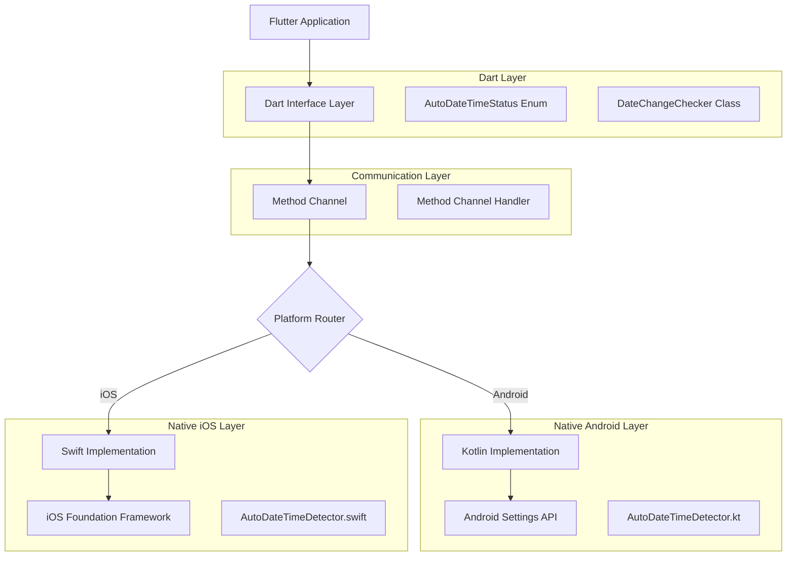
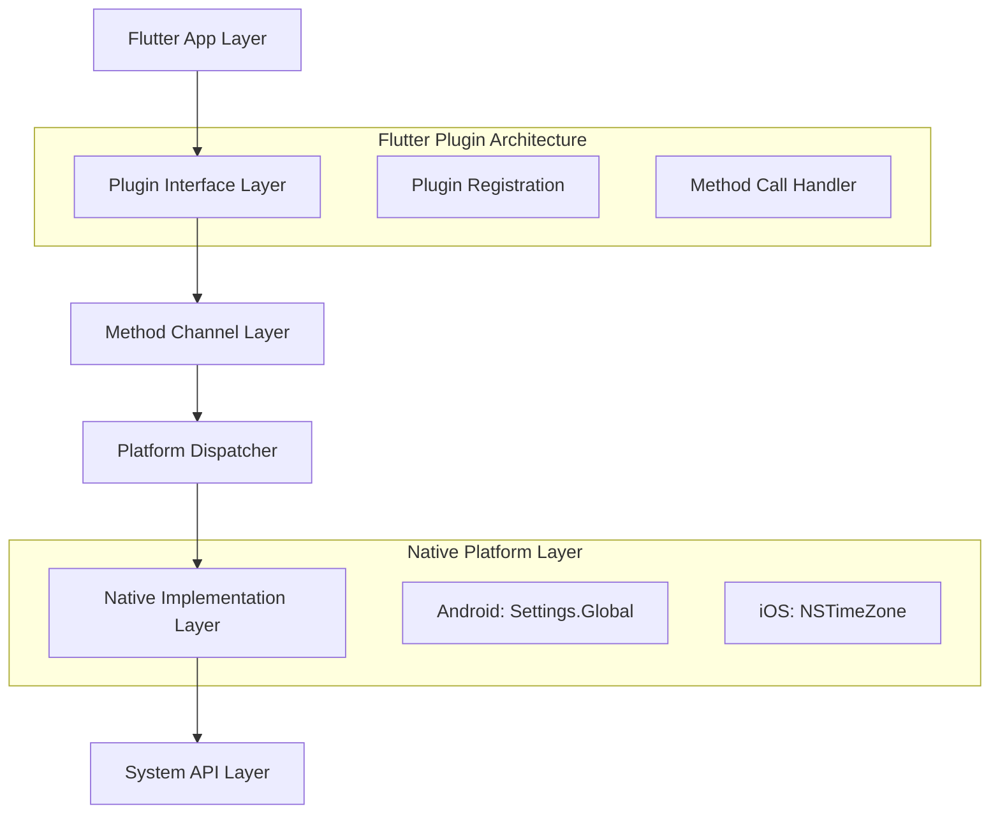
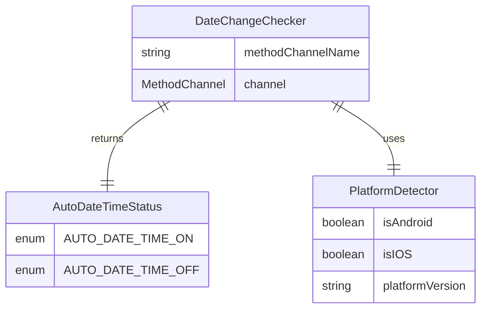

# Date Change Checker Flutter Package - Technical Architecture Document

## 1. Architecture Design



## 2. Technology Description

* **Frontend**: Flutter SDK 3.0.0+ with Dart 3.0+

* **Android Native**: Kotlin with Android API Level 21+

* **iOS Native**: Swift 5.0+ with iOS 11.0+

* **Communication**: Flutter Method Channels

* **Build System**: Flutter plugin architecture with platform-specific implementations

## 3. Route Definitions

| Route           | Purpose                                                       |
| --------------- | ------------------------------------------------------------- |
| /example        | Main example application demonstrating package functionality  |
| /settings-guide | Helper screen showing users how to enable automatic date/time |

## 4. API Definitions

### 4.1 Core API

**Dart Interface**

```dart
class DateChangeChecker {
  static Future<AutoDateTimeStatus> checkAutoDateTimeStatus();
}

enum AutoDateTimeStatus {
  AUTO_DATE_TIME_ON,
  AUTO_DATE_TIME_OFF
}
```

**Method Channel Communication**

```
Channel: 'date_change_checker'
Method: 'checkAutoDateTimeStatus'
```

Request:

| Param Name | Param Type | isRequired | Description                            |
| ---------- | ---------- | ---------- | -------------------------------------- |
| method     | string     | true       | Method name: 'checkAutoDateTimeStatus' |

Response:

| Param Name | Param Type | Description                                          |
| ---------- | ---------- | ---------------------------------------------------- |
| result     | boolean    | true if auto date/time is enabled, false if disabled |
| error      | string     | Error message if operation failed                    |

Example Response:

```json
{
  "result": true
}
```

**Error Response:**

```json
{
  "error": "Platform not supported"
}
```

### 4.2 Platform-Specific APIs

**Android Kotlin Implementation**

```kotlin
class AutoDateTimeDetector {
    fun isAutoDateTimeEnabled(context: Context): Boolean
}
```

**iOS Swift Implementation**

```swift
class AutoDateTimeDetector {
    static func isAutoDateTimeEnabled() -> Bool
}
```

## 5. Server Architecture Diagram



## 6. Data Model

### 6.1 Data Model Definition



### 6.2 Data Definition Language

**Dart Enum Definition**

```dart
/// Represents the status of automatic date/time setting on the device
enum AutoDateTimeStatus {
  /// Automatic date/time is enabled
  AUTO_DATE_TIME_ON,
  
  /// Automatic date/time is disabled
  AUTO_DATE_TIME_OFF
}
```

**Method Channel Configuration**

```dart
class DateChangeChecker {
  static const MethodChannel _channel = MethodChannel('date_change_checker');
  
  /// Checks if automatic date/time is enabled on the device
  /// Returns [AutoDateTimeStatus.AUTO_DATE_TIME_ON] if enabled
  /// Returns [AutoDateTimeStatus.AUTO_DATE_TIME_OFF] if disabled
  /// Throws [PlatformException] if platform is not supported
  static Future<AutoDateTimeStatus> checkAutoDateTimeStatus() async {
    try {
      final bool result = await _channel.invokeMethod('checkAutoDateTimeStatus');
      return result ? AutoDateTimeStatus.AUTO_DATE_TIME_ON : AutoDateTimeStatus.AUTO_DATE_TIME_OFF;
    } on PlatformException catch (e) {
      throw PlatformException(
        code: e.code,
        message: 'Failed to check auto date/time status: ${e.message}',
        details: e.details,
      );
    }
  }
}
```

**Android Implementation Structure**

```kotlin
// File: android/src/main/kotlin/com/example/date_change_checker/AutoDateTimeDetector.kt
class AutoDateTimeDetector {
    companion object {
        fun isAutoDateTimeEnabled(context: Context): Boolean {
            return try {
                Settings.Global.getInt(context.contentResolver, Settings.Global.AUTO_TIME) == 1
            } catch (e: Exception) {
                false // Default to false if unable to determine
            }
        }
    }
}
```

**iOS Implementation Structure**

```swift
// File: ios/Classes/AutoDateTimeDetector.swift
class AutoDateTimeDetector {
    static func isAutoDateTimeEnabled() -> Bool {
        // Check if the system timezone is set to automatically update
        let timeZone = NSTimeZone.autoupdatingCurrent
        let systemTimeZone = NSTimeZone.system
        
        // Compare if they are the same, indicating auto-update is enabled
        return timeZone.isEqual(to: systemTimeZone)
    }
}
```

## 7. Package Structure

```
date_change_checker/
├── lib/
│   ├── date_change_checker.dart          # Main export file
│   └── src/
│       ├── date_change_checker_base.dart # Core implementation
│       └── auto_date_time_status.dart    # Enum definition
├── android/
│   └── src/main/kotlin/com/example/date_change_checker/
│       ├── DateChangeCheckerPlugin.kt    # Plugin entry point
│       └── AutoDateTimeDetector.kt       # Android implementation
├── ios/
│   └── Classes/
│       ├── DateChangeCheckerPlugin.swift # Plugin entry point
│       └── AutoDateTimeDetector.swift    # iOS implementation
├── example/
│   ├── lib/main.dart                     # Example application
│   ├── android/                          # Example Android config
│   └── ios/                              # Example iOS config
├── test/
│   └── date_change_checker_test.dart     # Unit tests
├── pubspec.yaml                          # Package configuration
├── README.md                             # Documentation
├── CHANGELOG.md                          # Version history
└── LICENSE                               # License file
```

## 8. Error Handling Strategy

### 8.1 Platform Exception Handling

* **Unsupported Platform**: Throw PlatformException with clear message

* **Permission Denied**: Handle gracefully with fallback behavior

* **System API Failure**: Return default safe value with logging

### 8.2 Memory Management

* **Android**: Proper context handling, no static references

* **iOS**: ARC-compliant implementation, no retain cycles

* **Dart**: Async/await pattern with proper exception propagation

### 8.3 Performance Optimization

* **Caching**: No caching required as settings can change dynamically

* **Threading**: All native calls on background thread, results on main thread

* **Resource Usage**: Minimal memory footprint, no persistent connections

